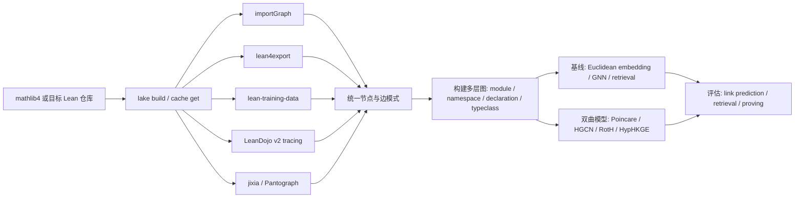

# Lean 与 Mathlib traced formal-math hierarchy 图的数据工程与双曲嵌入研究报告

## 执行摘要

本报告的核心结论有四点。第一，“traced formal-math hierarchy 图”并不是 Lean/mathlib 官方文档中的标准术语；在可证据化的 Lean/Mathlib 语境下，它更合适地被拆成五类对象：声明/定理依赖图、模块导入图、命名空间/模块层级、typeclass/coercion/structure 继承图，以及 blueprint 式的项目级定理依赖 DAG。若“traced”强调运行时或编译时追踪，则它最贴近 LeanDojo/LeanDojo-v2、lean-training-data 的 InfoTree 导出、jixia 的 elaboration/symbol trace、以及 Pantograph/PyPantograph 的交互式接口，而不仅仅是静态 import graph。citeturn30search3turn30search0turn28search2turn32search0turn5view3turn5view4

第二，Lean/Mathlib 相关的公开数据工程主线已经相当清晰：以 entity["organization","leanprover-community","lean theorem community"] 与 entity["organization","leanprover","lean core team"] 的工具链为基础，importGraph 负责模块导入层，lean4export 负责声明环境的 NDJSON 导出，lean-training-data、LeanDojo/LeanDojo-v2、jixia、PyPantograph/Pantograph 负责更细粒度的 proof state、premise、AST、symbol reference 与交互追踪，第三方研究管线如 mathlib-network 与 ProofGraph 则把这些原始导出进一步标准化为 CSV/多层网络/谱分析结果。官方与主流项目直接公开的格式以 `.dot` / `.pdf` / `.html` / `.xdot_json`、NDJSON、JSON/JSONL 与 CSV 为主；本次检索未找到“官方维护、直接面向 Lean/Mathlib”的 GEXF 默认导出工具，GEXF 更像后处理或第三方数据集格式，而不是官方第一类输出。citeturn28search4turn28search1turn30search0turn30search3turn28search2turn32search0turn16view0turn39search0

第三，就“是否已有把双曲嵌入/双曲深度学习直接用于 Lean/Mathlib traced hierarchy 图”的问题，本次检索的结论是：**没有找到公开、直接针对 Lean/Mathlib 声明依赖图、import graph、typeclass graph 或 traced proof graph 的双曲嵌入论文或成熟开源实现**。直接相关的形式化数学图学习工作主要仍是欧氏图表示或检索增强范式，例如 FormulaNet 在高阶逻辑公式图上做 premise selection，LeanDojo/ReProver 在 Lean/mathlib 上做 premise-aware retrieval 与证明，但并未采用双曲几何。相邻方向（而非直接命中 Lean/Mathlib）的双曲工作主要集中在层级表示、图神经网络与知识图谱嵌入，例如 Poincaré embeddings、HGCN、RotH/RefH/AttH、HypHKGE、以及面向 KG reasoning 的层级感知双曲 GNN。citeturn24search0turn24search2turn13search3turn30search3turn42search0turn41search1turn21search4turn41search2turn21search15

第四，从方法适配性看，双曲方法**最值得先试**的不是“全量、异质、语义极强的声明依赖大图”，而是层级性更强、关系类型更明确的子图：模块导入图、namespace/module tree、typeclass/coercion/structure 继承图、多关系的 declaration-module-namespace KG。对 Lean/Mathlib 全量依赖图，双曲方法的潜在收益在于低维表示、层级保真与长尾节点的组织能力，但会立刻遇到三类难题：图过于异质、合成边占比极高、纯拓扑不足以表达数学语义。尤其是《The Network Structure of Mathlib》指出，在其快照中依赖边里约四分之三是 elaborator/typeclass/coercion 合成边；这会明显干扰“几何半径≈数学抽象层级”的朴素解释。citeturn5view4turn22search4turn21search2turn21search10

## 定义与范围

“traced formal-math hierarchy 图”在 Lean/Mathlib 语境下**未见官方标准定义**。因此，最严谨的做法不是强行固定单一定义，而是把它分解为若干在公开工具链中确实存在的图对象，并标明哪些更贴近“traced”。这一点也与 LeanDojo-v2 把“repository tracing”定义为自动克隆并以 Lean instrumentation 提取 theorem information、proof states 与 structured data 的做法一致。citeturn30search3turn30search2

下表给出本报告采用的工作定义：

| 候选含义 | 在 Lean/Mathlib 中的可证据对象 | 与 “traced” 的贴合度 | 说明 |
|---|---|---:|---|
| 声明/定理依赖图 | 《The Network Structure of Mathlib》明确定义 declaration dependency、statement dependency、pure proof dependency；lean-training-data 的 `premises` 工具直接导出声明对其直接依赖项的使用关系。citeturn5view3turn30search0 | 高 | 若用户关心 theorem dependency graphs，这通常是最接近的解释。 |
| 模块导入图 | importGraph 明确以 Lake package 的 import structure 为对象，输出 `.dot`、`.xdot_json`、HTML 等；mathlib 官方统计页也指向现成的依赖可视化。citeturn6view0turn6view1turn36view0 | 中 | 更偏静态层级，不一定包含“追踪”语义。 |
| 命名空间/模块层级 | 《The Network Structure of Mathlib》把 module tree 与 namespace graphs 作为与文件系统层级、声明层级并列的组织层。citeturn5view2 | 中 | 更像“hierarchy”而不是“trace”。 |
| typeclass / coercion / structure inheritance 图 | 该论文还显式定义了 typeclass instance graph、coercion graph 与 synthesized/explicit 边划分。citeturn5view4 | 中高 | 非常适合研究 Lean 特有的“隐式层级”。 |
| blueprint 式定理依赖 DAG | leanblueprint 与 LeanArchitect 用 `\uses` 或 `@[blueprint]` 生成项目级定理/定义依赖图。citeturn39search2turn38view1 | 低到中 | 这是“人工策展”的 hierarchy，不是 Mathlib 全库自动踪迹。 |
| proof-state / elaboration trace graph | LeanDojo、LeanDojo-v2、jixia、PyPantograph/Pantograph 都能抽取 proof states、AST、symbol reference、elaboration/tactic data。citeturn30search3turn28search2turn32search0 | 很高 | 如果“traced”强调编译/交互追踪，这一类最贴切。 |

基于这些证据，本报告默认把用户问题理解为：**围绕 Lean/Mathlib 的 theorem/declaration dependency、import/module hierarchy、typeclass/coercion hierarchy 以及 proof-trace 图的数据工程工作；并进一步评估双曲嵌入能否用于这些图。** 这同时覆盖了用户提示中的 theorem dependency graphs、type/class hierarchy、import graph 与 module/package hierarchy。citeturn5view2turn5view4turn6view0turn30search3

## 已有工程与工具

公开可检索、且与 Lean/Mathlib 图数据工程直接相关的项目，已经形成了一条从“源码/编译环境”到“导出/标准化/可视化/研究分析”的较完整链路。一个直接的观察是：**官方/社区工具更偏“把正确的结构导出来”，研究型项目更偏“把导出的结构变成可训练、可分析的数据资产”。** 这两层不要混淆。citeturn29search0turn28search4turn28search1turn16view0turn39search0

### 公开项目与管线对比

| 项目 | 作者/组织 | 链接 | 主要功能 | 主要对象/图层 | 输出格式 | 可复现性 | 活跃度与许可 |
|---|---|---|---|---|---|---|---|
| mathlib4 | leanprover-community | 仓库与 Reservoir 页面 citeturn35search0turn29search0 | Lean 4 数学库本体；也是 importGraph、doc-gen4、本地 docs 构建与许多分析管线的基础数据源 | 模块、声明、文档、构建缓存 | `.lean` / `.olean` / docs 构建产物 | 高；官方文档给出 `lake build`、`lake exe cache get`、本地 docs 构建流程 | 2026-03-29 Reservoir 可见更新；Apache-2.0 citeturn29search0turn35search0 |
| importGraph | leanprover-community | README 与 Reservoir citeturn6view0turn28search4 | 分析 Lake package 的 import structure；支持裁剪源/目标范围；附带 `#redundant_imports`、`#min_imports`、`#find_home` | 模块导入图 | `.dot`、`.pdf`、`.xdot_json`、独立 HTML | 很高；命令明确、已集成 mathlib | 2026-03-28 Reservoir 更新；Apache-2.0 citeturn28search4turn6view2 |
| doc-gen4 / mathlib4_docs | leanprover | README、GitHub 组织页、Reservoir citeturn15view2turn28search5turn28search6 | 生成 Lean 4 API 文档站点；mathlib4 文档站由此构建；支持源码链接、查找入口 | 声明与文档层，间接服务于 hierarchy 导航 | HTML 文档站、搜索/查找界面 | 高；`lake build YourLibraryName:docs` 可复现 | 2026-03-29 Reservoir 更新；Apache-2.0 citeturn28search5turn15view2 |
| lean4export | leanprover | GitHub、Reservoir citeturn18view0turn28search3 | 把指定 Lean 模块及其传递依赖中的声明导出为 Lean 4 NDJSON export format | 声明环境、传递依赖 | NDJSON | 很高；示例命令直接作用于 `Mathlib` | 2026-04-26 Reservoir 更新；Apache-2.0 citeturn28search3turn18view0 |
| lean-training-data | Kim Morrison | GitHub citeturn30search0 | 导出 `premises`、`declaration_types`、goal/tactic 数据、docstring 数据、InfoTree JSON、tactic benchmark | 声明依赖、proof state、InfoTree、注释数据 | 纯文本、JSON、批量脚本输出 | 高；README 给出单文件与全库脚本 | 页面未稳定暴露单一“最后更新时间”；Apache-2.0 citeturn30search0 |
| LeanDojo | LeanDojo 团队 | GitHub 与论文/官网 citeturn30search2turn13search3turn13search4 | 从 Lean 仓库抽取 proof states、tactics、premises、AST、file dependencies，并提供程序化交互 | traced repo、premise graph、proof trace | JSON/JSONL 风格 benchmark 数据；程序接口 | 很高；论文与仓库都开放 | GitHub 组织页显示 2025-09-13 更新；MIT citeturn30search1turn30search2 |
| LeanDojo-v2 | LeanDojo 团队 | 官网与 PyPI citeturn30search3turn31search1 | 统一 repository tracing、dataset management、fine-tuning、proof search；强调 Lean 4 端到端工作流 | traced repo、训练数据、证明代理 | Python 包、训练/推理 artifact、JSONL 数据管线 | 很高；安装、训练与 tracing 流程公开 | PyPI 最新版本 1.0.8 发布于 2026-03-10；MIT citeturn31search1 |
| jixia | PKU BICMR AI for Math 项目 | GitHub citeturn28search2turn19search0 | 静态分析 Lean 4 文件；插件化导出 import、declaration、symbol reference、elaboration、line states、AST | 单文件/项目级 symbol reference graph 与 elaboration trace | 多个 JSON 文件（`.decl.json`、`.sym.json`、`.elab.json`、`.lines.json` 等） | 高；运行方式与版本匹配要求明确 | 公开页未稳定暴露统一更新时间；Apache-2.0 citeturn28search2turn19search0 |
| PyPantograph / Pantograph | Stanford Centaur / Lean 社区镜像 | GitHub、论文页、Springer citeturn32search0turn32search2turn32search4 | 机器对机器交互接口；执行 tactic、检查整文件、一致性验证、常量检查、提取 tactic invocation data | proof interaction trace、环境检查、常量/goal 操作 | Python API、REPL/共享库协议 | 高；安装与 API 公开 | Pantograph 会议版 2025；镜像仓库近 10 天更新；PyPantograph Repo 公开；Apache-2.0 / Python 包同类许可见仓库 citeturn32search5turn32search0 |
| mathlib-network | MathNetwork | GitHub README citeturn16view0 | 以 lean4export + lean-training-data 抽取 Mathlib 多层网络，并发布 HuggingFace 数据集 | declaration / module / namespace 多层图 | node/edge CSV、分析脚本、图表 | 很高；README 给出从本地重抽与直接载入公开数据两条路径 | README 当前公开；MIT citeturn16view0 |
| ProofGraph | Jonathan Llovet / ProofGraph | 官网与项目博客 citeturn39search0turn39search1 | 面向 Lean 4 依赖图的网络科学与谱分析；已完成全量 Mathlib 原型提取与谱分析 | declaration dependency graph | 网站可视化、谱分析结果；代码见项目链接 | 中高；原型已跑通，但仍在演进 | 2026-03-29 有最新公开结果；开源项目进行中 citeturn39search0turn39search1 |
| leanblueprint | Patrick Massot | GitHub citeturn39search2turn38view0 | 通过 `\uses`、`\lean`、`\leanok` 在蓝图文档中构建依赖图，并与 Lean 声明交叉链接 | 项目级 theorem/definition DAG | HTML/PDF blueprint，依赖图由 plasTeX/graphviz 生成 | 高；CLI 与 CI 流程完整 | 公开页未稳定暴露最新更新时间；Apache-2.0 citeturn39search2turn38view0 |
| LeanArchitect | hanwenzhu | GitHub citeturn38view1 | 直接从 Lean 源码中抽取 blueprint 节点与依赖，补足 leanblueprint 的“人工标注”痛点 | 项目级 theorem/definition DAG | LaTeX 片段、blueprint build 产物 | 高；`lake build :blueprint` 流程明确 | 公开页未稳定暴露最新更新时间；Apache-2.0 citeturn38view1 |
| mathlib-tools | leanprover-community | GitHub 搜索结果 citeturn10search3 | Lean 3 时代的 `leanproject` 辅助工具 | 非 Lean 4 图工程主线 | 命令行工具 | 历史可复现，但已不适用 Lean 4 | 明确标注“fully obsolete”；Apache-2.0 citeturn10search3 |
| leancrawler | leanprover-community | GitHub citeturn12view0 | 收集 Lean 3 库的统计与 relational information | Lean 3 统计/关系信息 | Python 库输出 | 历史性可复现 | 2025-08-15 archived；Apache-2.0；仅历史价值 citeturn12view0 |

从工程角度看，最值得特别点名的有三条链。其一是“**官方导出链**”：`lake build` / cache → `lean4export` → 外部解析；其二是“**社区图链**”：`mathlib4` → `importGraph` / `doc-gen4` → 可视化与站点导航；其三是“**AI/trace 链**”：LeanDojo/LeanDojo-v2、lean-training-data、jixia、Pantograph，把编译、证明与交互过程转成监督学习和代理系统可消费的数据。mathlib-network 与 ProofGraph 则处于这些链路的后段：它们不再关心“如何拿到 Lean 数据”，而是关心“如何把 Lean 数据变成研究对象”。citeturn18view0turn28search4turn15view2turn30search3turn30search0turn28search2turn32search0turn16view0turn39search0

还有一个很重要、常被忽略的细节：不同项目报告的 Mathlib 图规模并不完全一致。mathlib-network/《The Network Structure of Mathlib》报告的是约 308,129 个声明、8.4M 条边、7,563 个模块；ProofGraph 原型报告的是 323,489 个声明、7,516,850 条边。这个差异本身就是研究结论：**你在 Lean/Mathlib 上做图学习之前，必须先固定“节点定义、边定义、时间快照、是否包含合成边/元编程声明/外部依赖”的规范。** 否则同名“Mathlib graph”其实不是同一个数据集。citeturn16view0turn22search4turn39search0turn39search1

## 学术与应用研究

### 与形式化数学图直接相关的工作

在“形式化数学图”本身上，最直接的代表工作并不是双曲方法，而是图表示与检索增强。FormulaNet 把高阶逻辑公式表示为保持变量改名不变性的图，并在 HolStep 上把 premise selection 的分类准确率从 83% 提高到 90.3%；这是“把数学对象变成图后做学习”的一个经典起点，但它既不是 Lean，也不是双曲空间。citeturn24search0turn40view3

Lean 语境里的代表则是 LeanDojo。它把 Lean/mathlib 中的定理、proof states、tactics、premises 与 AST 做成开放 benchmark 和工具链；原始论文报告 LeanDojo Benchmark 含 98,734 个定理/证明，LeanDojo 官网进一步给出 LeanDojo Benchmark 4 含 122,517 个 theorem/proof、259,580 个 tactics、167,779 个 premises。LeanDojo/ReProver 的重点是 retrieval-augmented theorem proving，而不是显式图嵌入；但从图学习角度，它实际上已经提供了“accessible premises + hard negatives + proof-time accessibility constraints”这类最贴近实际 proving 任务的监督信号。citeturn13search3turn13search4turn30search3

### 图嵌入与双曲深度学习的代表性工作

下表聚焦与本题最相关的代表性论文/实现。这里我把“是否针对数学/定理依赖图”单独列出，以避免把一般 KG 工作误当成直接可迁移到 Lean/Mathlib 的现成答案。

| 工作 | 方法 | 数据集/任务 | 公开代码 | 是否针对数学/定理依赖图 | 可验证指标或结果 | 主要局限 |
|---|---|---|---|---|---|---|
| **FormulaNet**（NeurIPS 2017） | higher-order logic 公式图嵌入；保留边序信息 | HolStep premise selection | 有，`princeton-vl/FormulaNet` citeturn24search2 | **是，但不是 Lean/Mathlib** | HolStep 分类准确率由 83% 提升到 90.3% citeturn24search0turn40view3 | 不是双曲；数据来自 HOL，不含 Lean 的 elaboration/typeclass 机制。 |
| **LeanDojo / ReProver**（NeurIPS 2023） | program analysis + premise retrieval + prover | Lean/mathlib benchmark | 有，LeanDojo 与 ReProver 仓库/站点公开 citeturn30search2turn13search14 | **是，直接针对 Lean** | 论文报告 ReProver 优于非检索基线与 GPT-4；benchmark 为 98,734 theorem/proof；Lean 4 版 benchmark 规模更大 citeturn13search3turn13search4 | 不是图几何方法；检索器主体仍是文本/序列表示。 |
| **Poincaré Embeddings**（NeurIPS 2017） | 经典双曲层级嵌入 | WordNet hierarchy reconstruction | 有，官方仓库已归档 citeturn42search0 | 否 | 证明双曲空间适合层级表示；官方代码可复现 WordNet 练习与重建实验 citeturn42search0 | 主要针对树/taxonomy；不处理 Lean 这类异质多关系图。 |
| **HGCN**（NeurIPS 2019） | Hyperbolic Graph Convolutional Networks | node classification / link prediction（Cora、Pubmed、Disease、Airport） | 有，`HazyResearch/hgcn` citeturn41search1 | 否 | 公开 repo 给出 Airport 链路预测 ROC-AUC 97.43、Disease 节点分类 76.77% 的可复现实例命令 citeturn41search1 | 更适合“有特征的图学习”；Lean 依赖图需要先定义节点特征。 |
| **Low-Dimensional Hyperbolic Knowledge Graph Embeddings**（ACL 2020） | RotH / RefH / AttH 等低维双曲 KGE | WN18RR、FB15k-237、YAGO3-10 | 有，官方 `HazyResearch/KGEmb` citeturn41search0 | 否 | 官方 repo 示例显示 WN18RR 上 32 维 RotH 的 MRR 0.473 高于 32 维 RotE 的 0.455；500 维优势不再稳定 citeturn41search0 | 说明双曲优势更可能出现在“低维+层级关系”场景；Lean 图需先转成 KG。 |
| **HypHKGE**（2022/2024 版本） | attention-based learnable curvature + hierarchical transforms | WN18RR、FB15k-237、YAGO3-10 | 论文称将公开；代码索引页可见，但长期可用性需二次确认 citeturn21search4turn42search3 | 否 | 论文摘要明确声称在低维下优于现有双曲方法，尤其适合层级 KGs citeturn21search4turn40view2turn42search3 | 公开实现可维护性不如 KGEmb 明朗；仍非形式化数学图。 |
| **Fully Hyperbolic Rotation for KGE**（ECAI 2024，2026 上线） | 直接在 Lorentz 模型中定义 relation rotation | KG embedding | 本次检索未确认到稳定公开代码 | 否 | 摘要表明其目标是摆脱频繁 log/exp 映射，直接利用超曲率空间结构 citeturn41search2 | 代码与长期维护状态不明；与 Lean 图仍有较大落差。 |
| **Knowledge Graph Reasoning in Hyperbolic Space with Hierarchy-Aware GNN**（EMNLP 2025） | 双曲 GNN + hierarchy-aware message passing | KG reasoning | 本次检索未确认到稳定公开代码 | 否 | 官方摘要称在多种数据集和场景上持续优于现有技术 citeturn21search15 | 与 Lean/Mathlib 的证明依赖并非同任务；评测仍以通用 KG reasoning 为主。 |

从学术脉络上看，可以得到两个稳健判断。第一，**“定理/公式图学习”与“双曲层级学习”在文献上是两条平行发展线**：前者的代表是 FormulaNet、ReProver/LeanDojo 这类 theorem-proving 任务工作，后者的代表是 Poincaré/HGCN/RotH/HypHKGE 这类 hierarchy 或 KG 模型。第二，当前公开文献里，这两条线**尚未在 Lean/Mathlib traced hierarchy 图上真正汇合**。citeturn24search0turn13search3turn41search1turn41search0turn21search4

这也解释了为什么用户的问题是有研究价值的：在形式化数学上，图已经有了；在一般层级图上，双曲方法也已经有了；缺的正是**把 Lean/Mathlib 的结构特性、语义异质性与双曲几何归纳偏置拼到一起**。citeturn22search4turn39search0turn21search2

## 适用性评估

### 适配性最高的图类型

如果目标是尽快验证“双曲是否有用”，我不建议从全量 declaration dependency graph 起步，而建议先从下面三类图做起：

| 图类型 | 层级性 | 关系复杂度 | 双曲优先级 | 评语 |
|---|---:|---:|---:|---|
| 模块导入图 | 高 | 低 | 高 | import graph 近似 DAG/层级结构，最符合双曲空间擅长的“树状扩张”假设。citeturn28search4turn36view0 |
| typeclass / coercion / inheritance 图 | 高 | 中 | 很高 | 这是 Lean 特有的“隐式层级”；最像知识图谱中的 taxonomy + relation graph。citeturn5view4 |
| namespace / module tree | 很高 | 低 | 高 | 更像组织层级，可做低维可视化与层级保真度实验。citeturn5view2 |
| 全量 declaration dependency graph | 中 | 很高 | 中 | 节点很多、边极多且含大量合成边，几何解释会被噪声和异质性稀释。citeturn22search4turn5view4 |
| proof-state / tactic trace graph | 低到中 | 很高 | 低到中 | 这类图更偏程序轨迹与局部状态转移，未必天然满足稳定层级几何。citeturn30search3turn28search2turn32search0 |

### 可能的收益

双曲嵌入之所以值得在 Lean/Mathlib 上尝试，不在于“它更炫”，而在于它与若干已观测结构真的有匹配点。模块树、namespace tree、typeclass inheritance 都具备明显的层级扩张；低维知识图谱嵌入工作也一再表明，双曲方法的优势通常在**低维预算**与**层级明显**时最突出，而在高维上优势会变小甚至消失。KGEmb 官方结果中，32 维 RotH 优于 32 维 RotE；但到 500 维时这一优势不再明显，就是很好的提醒。citeturn41search0turn42search0

对 Lean/Mathlib 来说，这意味着双曲方法的现实收益很可能不是“把证明成功率神奇抬高很多”，而是更务实的三件事：其一，用更低维度保留 hierarchy-aware 近邻结构，降低索引与可视化成本；其二，在 declaration-module-namespace-typeclass 混合图上得到更接近“抽象层级”的径向组织；其三，在 premise retrieval 或 declaration search 中，为“更基础/更中心的结果”提供一种几何先验。LeanExplore 已经把 declaration-level dependency graph 用作 PageRank 信号，这从侧面说明“把图结构作为检索偏置”本来就是有价值的；双曲几何只是给这个偏置换一种更适合层级数据的表示方式。citeturn20search2turn19academia10

### 关键挑战

真正的难点并不在模型，而在数据定义。首先，Mathlib 声明图非常大；《The Network Structure of Mathlib》与 ProofGraph 都表明规模已到数十万节点、数百万到八百万量级边。其次，边并不“纯粹反映数学逻辑”：typeclass 解析、coercion 与 elaboration 会创造大量合成边，论文甚至报告其快照中合成边约占四分之三。换句话说，你如果直接把整张图喂给双曲模型，模型学到的可能不是“数学层级”，而是“Lean 编译器如何工作”。citeturn22search4turn39search0turn5view4

第三，双曲图学习并不是普适银弹。近年的综述与诊断工作反复强调，双曲收益依赖于潜在层级、噪声水平、曲率设定、优化稳定性以及是否真的受限于低维表示；若图并不近似树状、关系类型又高度混杂，双曲方法可能只增加训练复杂度，而不带来下游收益。对 Lean/Mathlib 来说，这一点尤其重要，因为 declaration dependency graph 同时混有数学内容、基础设施、元编程、文档辅助与自动合成机制。citeturn21search2turn21search10turn21search9

第四，纯图拓扑不足以表达数学语义。LeanDojo、LeanSearch、LeanExplore 之所以能做 premise retrieval / declaration search，是因为它们并不只看图，还看 theorem statement、proof state、docstring、自然语言辅助翻译与可访问前提约束。若将来真要把双曲方法用到 Lean/Mathlib 上，最靠谱的路径通常不是“纯结构 embedding”，而是**文本/符号编码器 + 图正则化或多视角对齐**。citeturn13search4turn26search0turn20search2

## 可复现实验设计

在现有工具成熟度下，最合适的研究路线不是先造新数据集，而是先用现有公开管线把评测问题定义清楚。下面给出三个难度递进、都可以在当前生态中落地的实验。

在流程上，建议采用下图所示的统一工作流。其意义在于，把“图抽取”与“模型训练”解耦：前者尽量 Lean 原生、可审计；后者尽量 Python 生态、可比较。对应工具分别来自 mathlib4、importGraph、lean4export、lean-training-data、LeanDojo/LeanDojo-v2、jixia 与 mathlib-network。citeturn29search0turn28search4turn18view0turn30search0turn30search3turn28search2turn16view0



### 声明图重建与链路预测

**目标。** 在较小但结构清晰的子图上，验证双曲方法是否能以更低维度重建 Lean hierarchy。首选图是模块导入图，其次是 typeclass/coercion graph。前者可由 importGraph 直接导出；后者可由《The Network Structure of Mathlib》定义或用 Lean 元编程/lean4export+jixia 的方式复建。citeturn28search4turn5view4

**数据准备。** 节点表建议至少保留：`id, name, kind, module, namespace, depth`。边表建议保留：`src, dst, edge_type, explicit_or_synthesized`。对 import graph，`edge_type=imports` 即可；对 typeclass/coercion graph，需要区分 `extends`、`instance`、`coercion`。训练/验证/测试按边随机切分远远不够，必须额外做“按模块层级切分”或“按新子树切分”，否则会高估泛化。citeturn6view0turn5view4

**模型与基线。** 基线可用 node2vec/DeepWalk、欧氏 TransE/RotE 与普通 GCN；双曲侧则用 Poincaré embeddings、HGCN、RotH/RefH/AttH。若只做 import DAG，Poincaré 或 HGCN 就够；若做多关系 hierarchy，优先 RotH/HypHKGE。citeturn42search0turn41search1turn41search0turn21search4

**评价指标。** 结构任务用 MAP / MRR / Hits@k / ROC-AUC；几何任务再加 hierarchy fidelity 指标，例如“节点径向坐标与模块深度/namespace 深度的 Spearman 相关”“按层级切分的 distortion”。若双曲方法只在随机切分上好，而在层级泛化切分上不占优，那它对 Lean/Mathlib 的实用价值就很有限。这个判断比单纯比 MRR 更重要。citeturn41search0turn41search1turn21search2

**资源与时间。** import graph 可在 CPU + 单卡 24GB GPU 下 1–2 天完成；typeclass/coercion graph 预处理更复杂，但一周内足以完成首轮结果。若只比较低维 8/16/32/64 维，训练预算不会高。citeturn28search4turn41search0turn41search1

### 多关系知识图补全

**目标。** 把 Lean/Mathlib 的多层对象组织成一个 heterogenous KG，例如 `(decl, depends_on_statement, decl)`、`(decl, depends_on_proof, decl)`、`(decl, in_module, module)`、`(decl, in_namespace, namespace)`、`(class, extends, class)`、`(instance, provides, class)`。这类数据更适合直接比较 ComplEx/RotatE 与 RotH/HypHKGE/FHR。statement/proof 分解、typeclass/coercion 图的明确定义已经由《The Network Structure of Mathlib》给出。citeturn5view3turn5view4

**数据准备。** 如果你希望完全从官方链路复现，可以用 lean4export 把声明环境导出，再用 lean-training-data 的 `premises` 区分 proof/statement 侧依赖，模块信息由 importGraph 或源文件路径补全。若希望快速开始，则直接使用 mathlib-network 已公开的 node/edge CSV，再自己补 relation typing。citeturn18view0turn30search0turn16view0

**模型与基线。** 欧氏基线：ComplEx、RotatE、AttE/RotE；双曲：RotH、RefH、AttH、HypHKGE；如果想验证“更纯粹的双曲旋转”是否值得，可额外加入 FHR。由于公式和定理名本身也有文本语义，最好加一个简单的文本初始化，例如把 declaration title / pretty-printed type 经轻量编码器投到初始化空间，再喂给 KG 模型微调。citeturn41search0turn21search4turn41search2

**评价指标。** 过滤式 MRR、Hits@1/3/10 是标准；但在 Lean/Mathlib 场景里，我更建议增加“低维效率曲线”，也就是画出维度 8/16/32/64 与性能关系。如果双曲模型的价值成立，它更可能体现在 16 或 32 维，而不是 512 维。citeturn41search0

**预期结果。** 我预计双曲模型会在 `class/instance/coercion/module` 这类层级关系上显著优于欧氏基线，在全量 `depends_on` 关系上则未必明显受益。原因是后者的语义更像“程序依赖 + 数学依赖 + elaborator 边”的混合体。citeturn5view4turn21search2

**资源与时间。** 一张 24–48GB GPU 足够做首轮；若全图超过显存，做 relation-wise mini-batch 和子图采样即可。预处理 2–4 天，训练 3–5 天，误差分析 2–3 天。citeturn16view0turn41search0

### 图正则化前提检索

**目标。** 不是单纯重建图，而是测试双曲几何是否能改善真正的 Lean 下游任务。最直接的下游任务就是面向 LeanDojo Benchmark 4 的 premise retrieval：给定 proof state 或 theorem statement，检索最相关的 accessible premises。LeanDojo 已经把 premise information、accessible premises 与 hard negatives 这类训练信号准备好了。citeturn13search3turn13search4

**数据准备。** 用 LeanDojo Benchmark 4 的 theorem/proof/premise 数据作为主监督；再把同一快照下的 declaration dependency / import / namespace / typeclass 图连接进来，形成“文本视角 + 图视角”的多视图数据。这里不必让双曲模型直接生成 proof；只需让它作为 retriever 的结构正则化项或额外编码器即可。citeturn13search4turn30search3

**模型与基线。** 基线是标准双塔检索器或 ReProver 的 premise retriever；实验组则在 premise / state 表示上加入双曲投影、层级感知图正则项，或用 HGCN 在 premise graph 上做结构增强，再与文本 embedding 融合。由于 Lean proving 的最终目标是 theorem success rate，而不是 graph metric，因此这里要把图方法放在“帮助检索”而不是“替代文本”的位置。citeturn13search14turn41search1

**评价指标。** 先看 retrieval Recall@k / MRR / accessible premise coverage，再看 prover 级指标，例如 pass@1、成功证明数、平均检索延迟。若图正则化能提高 Recall@32 或 Recall@64，但证明成功率不变，就说明结构信息还没被真正转化为证明增益。citeturn13search3turn13search4

**资源与时间。** 这是三个方案里最贵的。单做检索器可在 1–2 张 40GB 级 GPU 上一周内完成；若进一步接 prover 联调，建议预留两周。优势是研究价值最高，因为它直接回答“图表示是否真的帮助 Lean 证明”。citeturn13search3turn30search3

### 推荐的最小数据格式

为了方便后续在欧氏/双曲/KG 模型之间切换，我建议先把 Lean 侧导出统一成一个中间层。下面这个最小模式已经足够支撑上面三个实验；它兼容 importGraph、lean4export、lean-training-data、jixia 与 LeanDojo/ntp-toolkit 风格的数据。对应的字段设计分别来自这些工具的公开说明。citeturn6view0turn18view0turn30search0turn28search2turn12view2

```text
nodes.csv
id,name,kind,module,namespace,is_theorem,is_definition,is_instance,depth

edges.csv
src,dst,edge_type,edge_origin
# edge_type in {imports, depends_stmt, depends_proof, depends_mixed, extends, instance_of, coercion}
# edge_origin in {explicit, synthesized, traced, static}

triples.tsv
head    relation    tail

states.jsonl
{"decl_id":"Mathlib.Topology....",
 "state":"⊢ ...",
 "accessible_premises":["A","B","C"],
 "used_premises":["B","C"]}
```

## 结论与开放问题

如果把用户的问题压缩成一句话，结论就是：**Lean/Mathlib 上“图的数据工程”已经很成熟，但“把双曲嵌入真正用到这些图上”目前基本还是空白。** 前半句的证据来自 importGraph、doc-gen4、lean4export、lean-training-data、LeanDojo/LeanDojo-v2、jixia、PyPantograph/Pantograph、mathlib-network、ProofGraph 等一整条公开链路；后半句则来自本次检索中没有发现针对 Lean/Mathlib traced hierarchy 图的公开双曲论文或主流实现，而只发现了相邻方向的一般层级/KG 双曲工作。citeturn28search4turn15view2turn18view0turn30search0turn30search3turn28search2turn32search0turn16view0turn39search0turn41search1turn41search0turn21search4

因此，最稳妥的研究策略不是直接宣称“Lean 图天然适合双曲空间”，而是分层推进：先从 import/typeclass/coercion 这类高层级、低异质的图验证低维双曲优势；再把多关系 declaration graph 转成 KG 做补全实验；最后才把双曲结构偏置接到 LeanDojo 这类真实 proving 任务中，检验它是否能改善 premise retrieval 与 theorem success。只有第三步也成立，才能说“双曲方法对 Lean/Mathlib traced hierarchy 图不只是几何上好看，而是对形式化数学工作流真的有用”。citeturn28search4turn5view4turn41search0turn13search4

仍然存在的开放问题主要有三类。其一，本次检索中若干新近双曲 KG 论文的代码可获得性和长期维护状态并不稳定，尤其是 HypHKGE、FHR、EMNLP 2025 的层级感知双曲 reasoning 系统；这会影响严格复现。其二，Lean/Mathlib 图的“正确标准化定义”仍是研究问题：是否纳入 synthesized edges、如何处理 tactic/metaprogramming 声明、如何对齐不同快照，都会直接改变结论。其三，尚缺一个社区认可的“Lean graph representation benchmark”，使得图重建、premise retrieval 与 theorem proving 之间的关系可以被系统比较。正因为这三个问题都还没有被完全解决，围绕 Lean/Mathlib traced hierarchy 图开展双曲表示学习，仍然是一个很有空间、但必须从数据定义开始做严谨控制的研究方向。citeturn5view4turn39search1turn30search3turn21search15turn41search2

## 参考文献

1
https://leandojo.org/leandojo.html
reservoir.lean-lang.org

2
https://reservoir.lean-lang.org/%40leanprover-community/importGraph

7
https://reservoir.lean-lang.org/%40leanprover-community/mathlib

10
https://reservoir.lean-lang.org/%40leanprover/doc-gen4

12
https://reservoir.lean-lang.org/%40leanprover/lean4export

3
https://arxiv.org/abs/1709.09994

4
The Network Structure of Mathlib
https://arxiv.org/html/2604.24797v1

25
https://arxiv.org/abs/2306.15626

30
https://arxiv.org/html/2204.13704v2

33
https://arxiv.org/html/2604.24797v1

34
https://arxiv.org/html/2506.11085v1

35
https://arxiv.org/html/2202.13852v4
github.com

5
GitHub - leanprover-community/import-graph: Tool to analyse the import structure of lean projects. · GitHub
https://github.com/leanprover-community/import-graph

6
https://github.com/PatrickMassot/leanblueprint

8
https://github.com/leanprover-community/mathlib4

9
https://github.com/leanprover/doc-gen4

11
https://github.com/leanprover/lean4export

13
https://github.com/kim-em/lean-training-data

14
https://github.com/lean-dojo/leandojo

15
https://github.com/lean-dojo

17
https://github.com/frenzymath/jixia

18
https://github.com/stanford-centaur/PyPantograph

20
https://github.com/MathNetwork/mathlib-network/blob/main/README.md

22
https://github.com/hanwenzhu/LeanArchitect

23
https://github.com/leanprover-community/mathlib-tools

24
https://github.com/leanprover-community/leancrawler

26
https://github.com/princeton-vl/FormulaNet

27
https://github.com/facebookresearch/poincare-embeddings

28
https://github.com/HazyResearch/hgcn

29
https://github.com/HazyResearch/KGEmb

36
https://github.com/lean-dojo/ReProver
pypi.org

16
https://pypi.org/project/lean-dojo-v2/
repos.ecosyste.ms

19
https://repos.ecosyste.ms/hosts/GitHub/repositories/leanprover%2FPantograph
proofgraph.org

21
https://proofgraph.org/
journals.sagepub.com

31
https://journals.sagepub.com/doi/abs/10.3233/FAIA240668
aclanthology.org
32
https://aclanthology.org/2025.emnlp-main.1279.pdf